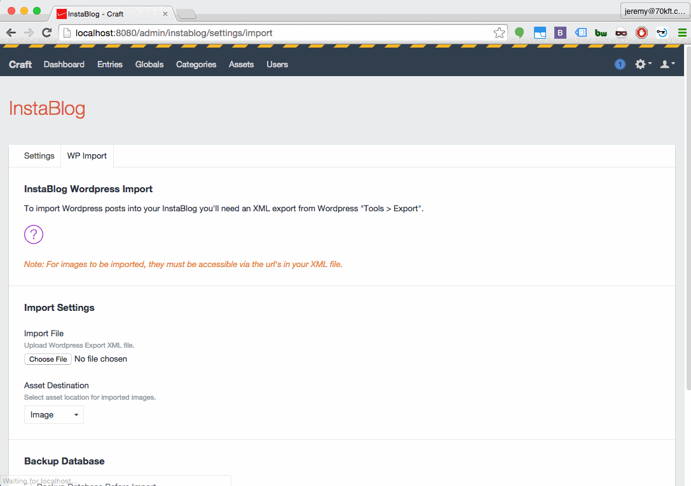

# Instablog plugin for Craft CMS

A plugin to quickly set up a blog on [Craft CMS](http://buildwithcraft.com) websites. 

## Why Instablog?

Blogs are ubiquitous and certain features are expected. Because Craft is designed to be a blank slate, you have to create these features when you want a blog running on Craft. Recreating the same features every time you need a blog is a drag.

At [70kft](http://70kft.com), we commonly receive requests to add a blog to our client's Craft sites. Prefering to avoid Wordpress and the grind of manually creating blog functionality from scratch, our solution was to fast track blog setup with this plugin. Save time by treatin yo-self to an InstaBlog.

## What's Included

* Tags
* Categories
* Search
* Archive
* Pagination
* RSS Feed
* Social Sharing
* OpenGraph Meta Tags
* Authorship Schema Markup
* [Disqus](http://disqus.com) Comments
* Wordpress Import
** Includes categories, tags, authors, posts and images
** Images in WP content field converted to assets
** Image src in WP content field converted to asset links
** Full size WP images saved as assets
** WP links to full size images converted to asset links
** Internal blog links converted to entry links

## Installation

1. Unzip file and place `instablog` directory into your `craft/plugins` directory
2.  -OR- do a `git clone https://github.com/70kft/craft-instablog.git .` directly into your `craft/plugins` folder.  You can then update it with `git pull`
3. Install plugin in the Craft Control Panel under Settings > Plugins

During install InstaBlog will create a category group, tag group, field group, fields, and a section called InstaBlog. Additionally, InstaBlog will create a folder called `blog` in your site template folder. Within that folder various twig template files will be created. You can modify these as you would your own site templates.

### Requirements

**Writable Template Directory**
Your template folder `craft/templates` must be php writable during install/uninstall in order for the plugin to create/remove the blog templates. While that may seem inconvienient, it's going to be ok. [Just do it.](https://www.youtube.com/watch?v=DvVUBZy_MHE). You can change your permissions back after install.

**Client/Pro version OR no pre-existing channels**
InstaBlog creates a channel during install. If you have Client/Pro version of Craft, an additional channel is allowed. If you are running on the free version, you are allowed only one channel. So, InstaBlog can only be installed if you do not already have a channel created.

## Configuration

On the Settings > Plugins > InstaBlog settings page there are three sections:

* InstaBlog Layout Template
* Social Settings
* Disqus Settings

### InstaBlog Layout Template

InstaBlog comes with bare bones templates which aren't intended for live sites. They are your foundation for a custom blog theme. These templates extend a layout which you can override by specifying a different layout here to extend.

### Social Settings

Facebook, Twitter, Google+, and Linkedin. Social settings are used to set up OpenGraph meta tags and to create "follow" links. InstaBlog will also create user fields for Craft users which will appear under each user profile tab. (Client or Pro version only). If a user has added their social settings on their profile and they author a blog post, InstaBlog will use their personal settings for OpenGraph meta tags and other schema. If an author has not entered their social settings Instablog will default to the social settings used on the plugin settings page.

### Disqus Settings

Instablog is using Disqus for comments on blog posts. To enable Disqus, [create a Disqus](http://disqus.com)  account and add your Disqus short name here.

### Wordpress Import

Simply export your posts to xml file from your Wordpress site via WP Admin > Tools > Export and upload via InstaBlog's Wordpress Import tool. All of the authors, categories, tags, posts, and images will be imported into  InstaBlog.

## Uninstall

During uninstallation, InstaBlog will remove *ALL* of the Craft fields, section, tags, categories, and the entire `blog` folder of templates which were created during install. If you added things to that blog folder or are using the InstaBlog field group fields in other areas of your site, then you probably should not uninstall, you've been warned!

#### Credit

Instablog borrowed from [Roi Kingon's](https://github.com/rkingon/Craft-Plugin--Trimmer) Trimmer plugin to handle truncating blog posts.